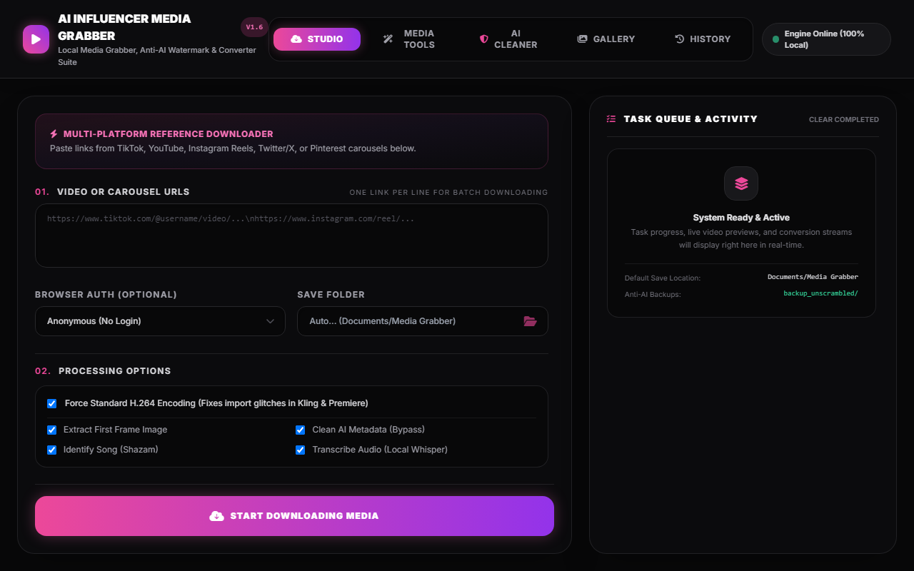
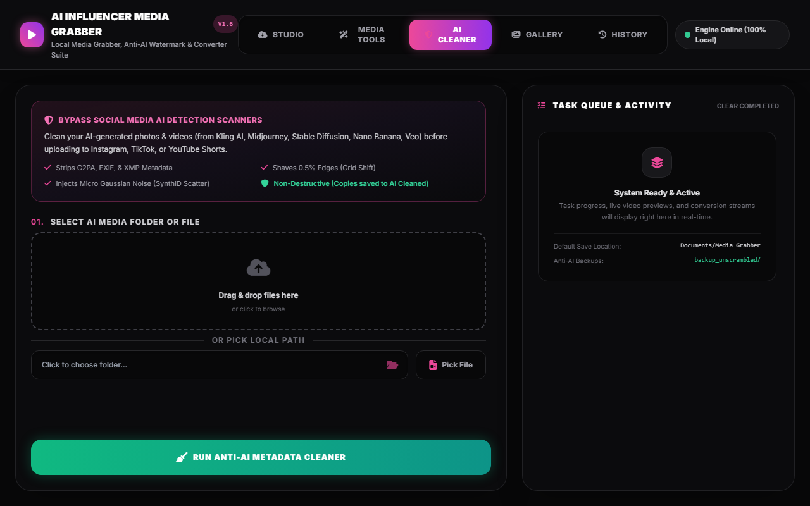
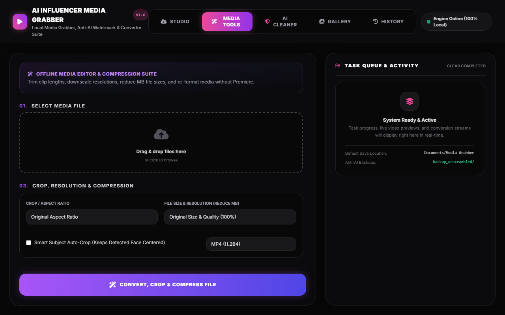
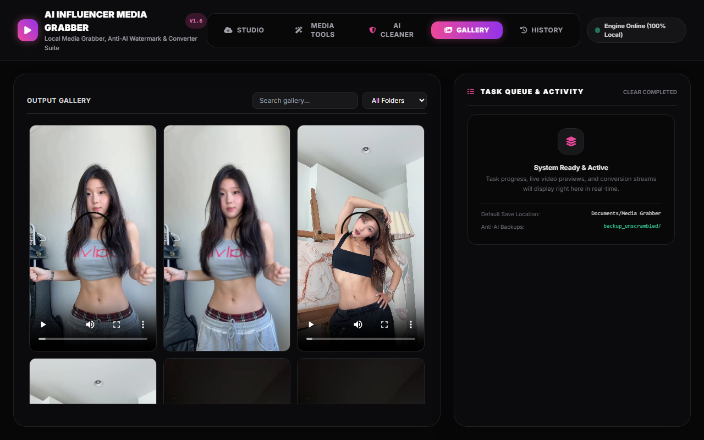

# 🎥 AI Influencer Media Grabber

 

## 🌟 What is the AI Influencer Media Grabber?

**AI Influencer Media Grabber** is your ultimate, all-in-one desktop toolkit for social media content creators, video editors, and AI artists. Instead of relying on sketchy, ad-filled websites to download videos or convert files, this app runs **100% locally on your computer** with a beautiful, modern interface.

Whether you're building a massive reference folder of TikTok trends, extracting music from Instagram Reels, pulling perfectly-framed thumbnails for YouTube shorts, or prepping videos for AI generation tools like Kling—this grabber automates the entire workflow in just a few clicks. It's safe, blazing fast, completely private, and incredibly powerful.

## 📸 Interface Preview

  
  
   
  
  

## ✨ Features

### 🛡️ AI Cleaner Tab (Flagship Anti-AI Detection Engine)
The dedicated centerpiece feature designed specifically for AI creators and influencers. Select any local folder or file containing your AI-generated creations (from **Kling AI, Midjourney, Stable Diffusion, Google Nano Banana, Veo, etc.**) to make them look like authentic camera footage:
- **C2PA & EXIF Stripping:** Automatically removes software manifests, generator tags, and metadata that social media algorithms read at upload time.
- **SynthID Pixel Scatter:** Shaves 0.5% off image/video edges (shifting the coordinate grid) and injects a microscopic layer of film grain (Gaussian noise). Confuses AI visual classifiers without any loss of visual quality.
- **Built-in Folder & File Browser:** Choose entire project folders or individual media files via the sleek in-app browser modal — no external processes required.
- **Non-Destructive Editing:** All files are safely copied to the `AI Cleaned` folder before processing. Your original source files remain 100% untouched as their own backups.
- **Deduplication:** Keeps track of processed files in registry text logs so you never waste time double-cleaning media.

### 📥 Reference Downloader Engine
- **Platform Support:** Rips high-quality reference media from TikTok, YouTube, Twitter/X, and more.
- **Instagram Master:** Easily download Instagram Reels, profile dumps, and multi-photo Carousels.
- **Dual-Engine Auto-Fallback:** Combines `yt-dlp` and `gallery-dl` for 100% extraction reliability.
- **Audio Transcription & Shazam:** Runs local AI (Whisper) for text transcripts and Shazam to identify background tracks.
- **Kling / AI Tool Compatibility:** Forces standard `H.264` MP4 encoding on reference downloads so they import cleanly into AI video generation tools.

### 🛠️ Media Tools Converter
A dedicated offline media suite to format and tweak your media:
- **Convert:** Instantly convert videos to GIF, MP3, MP4, or PNG frame sequences.
- **Smart Framing:** Crop dimensions, resize resolutions, and trim clip lengths offline.

---

## ?? How to Download & Run (For Beginners)

If you don't know how to use the command line, don't worry! Running this app is incredibly simple.

### 🛠️ Step 1: Install Python (Prerequisite)
If you already have Python installed, you can skip this step!

1. **Download Python (Version 3.10 or newer)** from the official website:
   👉 [Click here to download Python](https://www.python.org/downloads/)
2. Open the downloaded installer.
3. ⚠️ **CRITICAL STEP**: When the installer opens, look at the **very bottom of the first window**. You **MUST** check the small box that says **"Add python.exe to PATH"** before clicking Install. If you don't check this box, the app will not work!
4. Click "Install Now" and let it finish.

### 🚀 Step 2: Download & Run AI Influencer Media Grabber
1. Go to the top of this GitHub page and click the green **"<> Code"** button.
2. Click **"Download ZIP"**.
3. Once downloaded, **Extract/Unzip** the folder anywhere on your computer (like your Desktop).
4. Open the extracted folder and simply **double-click** the file named `run.bat`.
5. *(Optional)* **Double-click** the file named `create_shortcut.bat`! This will place a convenient app icon right on your Desktop so you never have to open this folder again.

### That's it! 🎉
The `run.bat` script is fully automated. It will download everything it needs, install all the requirements, and instantly pop open the beautiful AI Influencer Media Grabber interface in your web browser. 

*Note: By default, all of your downloaded videos, photos, and converted media will be neatly saved in your `Documents/Media Grabber` folder!*

*Note: The very first time you run it, it might take a few minutes to download the AI models and setup the environment. Every time after that, it will launch instantly!*

---

## 📜 Changelog

### v1.5 (Current)
- **New Feature:** Replaced buggy native OS dialogs with a sleek, built-in HTML/JS folder and file browser modal.
- **Enhancement:** Gallery now recursively scans subdirectories (e.g., YouTube playlists).
- **Enhancement:** yt-dlp auto-updates are now checked daily instead of on every startup, greatly improving launch time.
- **Optimization:** Waitress server threads increased to 8 to handle multiple concurrent downloads.
- **Fix:** Fixed asyncio event loop leaks and bare except clauses.

### v1.4
- **New Feature:** `AI Cleaner` Tab added to the main UI. You can now browse for a folder or file to securely scramble pixels and strip metadata in batch!
- **New Feature:** Auto-Bypass added to the Studio Downloader tab. Instantly bypass AI detectors when downloading media from the web.
- **Enhancement:** All FFmpeg binaries are fully self-contained using `imageio_ffmpeg` (no more manual installations!).
- **Safety:** Automatic backup folder generation (`backup_unscrambled`) and duplicate-prevention tracking added.
- **UI:** Added Live Terminal for the Batch Cleaner utilizing Server-Sent Events (SSE).

### v1.3 
- Added Media Tools Converter for offline editing, UI refinements, and local audio transcriptions using Whisper AI.
