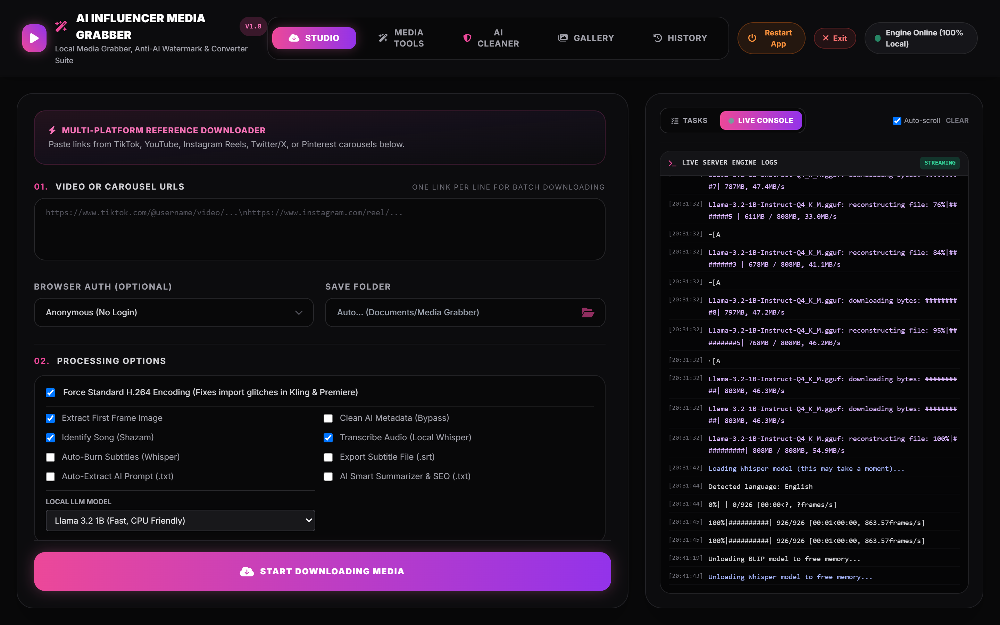
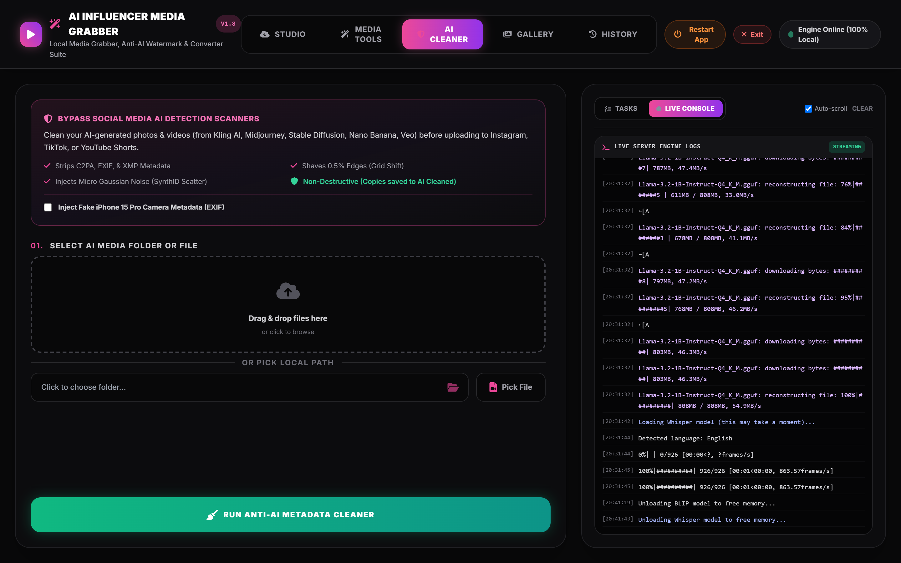
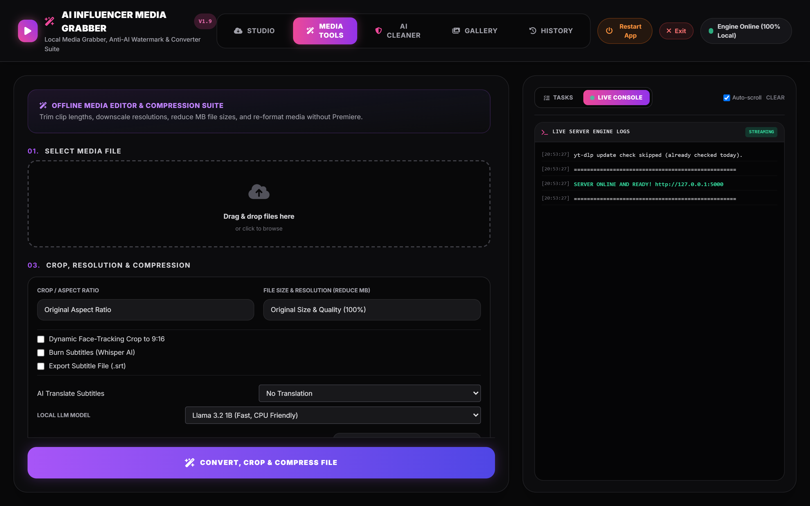
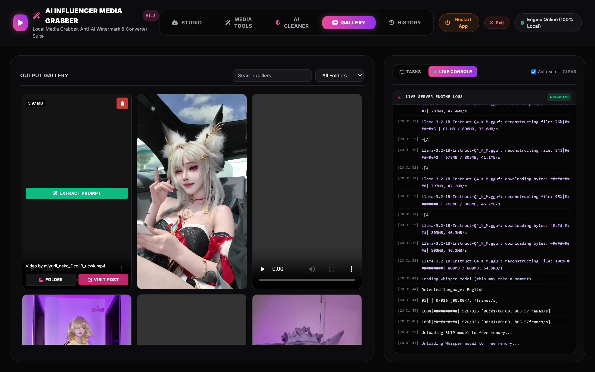

# AI Influencer Media Grabber v1.8

 

## 🌟 What is the AI Influencer Media Grabber?

**AI Influencer Media Grabber** is your ultimate, all-in-one desktop toolkit for social media content creators, video editors, and AI artists. Instead of relying on sketchy, ad-filled websites to download videos or convert files, this app runs **100% locally on your computer** with a beautiful, modern interface.

Whether you're building a massive reference folder of TikTok trends, extracting music from Instagram Reels, pulling perfectly-framed thumbnails for YouTube shorts, extracting AI prompts, or prepping videos for AI generation tools like Kling—this grabber automates the entire workflow in just a few clicks. It's safe, blazing fast, completely private, and incredibly powerful.

## 📸 Interface Preview

  
  
   
  
  

## ✨ Features

### 🛡️ AI Cleaner Tab (Flagship Anti-AI Detection Engine)
The dedicated centerpiece feature designed specifically for AI creators and influencers. Select any local folder or file containing your AI-generated creations (from **Kling AI, Midjourney, Stable Diffusion, Google Nano Banana, Veo, etc.**) to make them look like authentic camera footage:
- **C2PA & EXIF Stripping:** Automatically removes software manifests, generator tags, and metadata that social media algorithms read at upload time.
- **iPhone 15 Pro EXIF Injection:** Optional feature to inject realistic Apple iPhone 15 Pro camera EXIF & device metadata onto scrambled photos and videos.
- **SynthID Pixel Scatter:** Shaves 0.5% off image/video edges (shifting the coordinate grid) and injects a microscopic layer of film grain (Gaussian noise). Confuses AI visual classifiers without any loss of visual quality.
- **Built-in Folder & File Browser:** Choose entire project folders or individual media files via the sleek in-app browser modal — no external processes required.
- **Non-Destructive Editing:** All files are safely copied to the `AI Cleaned` folder before processing. Your original source files remain 100% untouched as their own backups.
- **Deduplication:** Keeps track of processed files in registry text logs so you never waste time double-cleaning media.

### 🪄 AI Prompt Extractor (Vision Engine)
- **Image & Video to Prompt:** Extract high-quality AI prompts (formatted for Nano Banana 2 / Pro & GPT Image 2) directly from images or the first frame of videos using local PyTorch vision models (`Salesforce/blip-image-captioning-large`).
- **Gallery Integration:** Extract prompts directly from any video or image in your Output Gallery with a single click.

### 📥 Reference Downloader Engine
- **Platform Support:** Rips high-quality reference media from TikTok, YouTube, Twitter/X, and more.
- **Instagram Master:** Easily download Instagram Reels, profile dumps, and multi-photo Carousels.
- **Dual-Engine Auto-Fallback:** Combines `yt-dlp` and `gallery-dl` for 100% extraction reliability.
- **Audio Transcription & Subtitles:** Runs local AI (Whisper) for text transcripts, auto-burned subtitles, and Shazam to identify background tracks.
- **Kling / AI Tool Compatibility:** Forces standard `H.264` MP4 encoding on reference downloads so they import cleanly into AI video generation tools.

### 🛠️ Media Tools Converter
A dedicated offline media suite to format and tweak your media:
- **Convert & Subtitle:** Convert videos to GIF, MP3, MP4, or PNG frame sequences with optional Whisper AI auto-subtitle burning.
- **Granular Size & MB Compression:** Multi-tier compression profiles (~50%, ~75% Web/Discord, ~80%, ~85%, ~90% Extreme) with intelligent dimension downscaling for Discord-friendly GIFs (under 10MB).
- **Smart Framing & Blurred Padding:** Crop dimensions, resize resolutions, convert 16:9 to 9:16 vertical format with a blurred background canvas, and trim clip lengths offline.

---

## 💡 How to use the AI Prompt Extractor
1. Go to the **Output Gallery** tab to view your downloaded videos and images.
2. Hover over any video or image card.
3. Click the shiny **Extract Prompt** button that appears in the overlay menu.
4. Wait a moment for the AI to analyze the media. 
   - ⚠️ **First Run Disclaimer:** The very first time you click this button, the app will automatically download the local PyTorch Vision Model (`BLIP-Large`, approx. 1.9GB) in the background. After the download completes, you can simply click the orange **Restart App** button in the header for the model to load properly. All subsequent extractions will be instant and completely offline!
5. A popup will appear with your generated prompt, optimized specifically for **Nano Banana 2**, **Nano Banana Pro**, and **GPT Image 2** models.

---

## 💻 How to Download & Run (For Beginners)

If you don't know how to use the command line, don't worry! Running this app is incredibly simple.

### 🛠️ Step 1: Install Python (Prerequisite)
If you already have Python installed, you can skip this step!

1. **Download Python (Version 3.10 or newer)** from the official website:
   👉 [Click here to download Python](https://www.python.org/downloads/)
2. Open the downloaded installer.
3. ⚠️ **CRITICAL STEP**: When the installer opens, look at the **very bottom of the first window**. You **MUST** check the small box that says **"Add python.exe to PATH"** before clicking Install. If you don't check this box, the app will not work!
4. Click "Install Now" and let it finish.

### 🚀 Step 2: Download & Run AI Influencer Media Grabber
1. Go to the top of this GitHub page and click the green **"<> Code"** button.
2. Click **"Download ZIP"**.
3. Once downloaded, **Extract/Unzip** the folder anywhere on your computer (like your Desktop).
4. Open the extracted folder.
    - **Windows:** Simply **double-click** the file named `run.bat`.
    - **Mac/Linux:** Open terminal in the folder and run `bash run.sh`
5. *(Optional for Windows)* **Double-click** the file named `create_shortcut.bat`! This will place a convenient app icon right on your Desktop so you never have to open this folder again.

### That's it! 🎉
The startup script is fully automated. It will download everything it needs, install all the requirements, and instantly pop open the beautiful AI Influencer Media Grabber interface in your web browser. 

*Note: By default, all of your downloaded videos, photos, and converted media will be neatly saved in your `Documents/Media Grabber` folder!*

*Note: The very first time you run it, it might take a few minutes to download the AI models and setup the environment. Every time after that, it will launch instantly!*

---

## 📜 Changelog

### v1.8 (Current)
- **New Feature**: **Local LLM Integration**! You can now run heavy AI models (Llama 3.2 1B & Llama 3 8B) entirely offline directly in the app.
- **New Feature**: **AI Smart Summarizer (Downloader)**. Check a box and the LLM will read the video's transcript to generate a summary, 3 viral TikTok/Reels captions, and SEO hashtags automatically!
- **New Feature**: **Nano Banana Prompts**. The Auto-Extract AI Prompt feature now routes the basic image description through the Local LLM to perfectly format highly detailed prompts specifically for *Nano Banana Pro* & *Nano Banana 2*.
- **New Feature**: **Offline Subtitle Translation**. Use the Local LLM in the Converter tab to translate your video's auto-generated subtitles to English, Spanish, French, German, or Japanese entirely offline.
- **New Feature**: **Dynamic Face-Tracking Auto-Crop (Converter)**. The Converter can now intelligently track the speaker's face frame-by-frame and gracefully pan the camera to keep them in the center of the vertical 9:16 frame.
- **Enhancement**: Subtitles can now be exported directly as `.srt` files alongside the downloaded or converted videos.

### v1.7
- **Security & Stability:** Fixed major path traversal vulnerabilities, plugged memory leaks in download tasks and temporary folder creations, and eliminated SSE loop hangs.
- **Memory Management:** Added automatic RAM and VRAM garbage collection. AI models (Whisper and BLIP) now intelligently self-unload after 10 minutes of inactivity to keep your system fast.
- **UX Improvements:** Implemented native keyboard shortcuts (`Ctrl/Cmd + Enter` to start tasks, `Escape` to close modals). User settings and dropdowns now automatically persist across sessions using `localStorage`.
- **UI Enhancements:** The Gallery tab now auto-refreshes when a task finishes. Added an "Open Folder" quick action directly on completed download tasks.
- **Performance:** Implemented a smart 2-second cache on the Gallery API to prevent filesystem thrashing during rapid searches.

### v1.6
- **New Feature:** Added **AI Prompt Extractor** powered by local PyTorch Vision models (`BLIP-Large`) to extract Nano Banana 2 / Pro & GPT Image 2 prompts from image/video frames in the Output Gallery.
- **New Feature:** Added **UI Hard Restart Button** in the header to reboot the local server with one click.
- **New Feature:** Added **Auto Subtitle Burner** in Media Tools & Downloader powered by local Whisper AI transcription.
- **New Feature:** Added **Blurred-Background Padding (9:16)** option in Converter to turn horizontal 16:9 videos into vertical 9:16 format with blurred background canvas.
- **New Feature:** Added **Fine-Tuned MB Compression Levels** (50%, 75%, 80%, 85%, 90%) with automatic dynamic scaling for GIF exports to hit Discord limits.
- **New Feature:** Added **Fake iPhone 15 Pro EXIF Metadata Injector** in AI Cleaner to inject realistic Apple camera metadata into cleaned media.
- **Fix:** Fixed multi-part FormData conversion handling and Flask thread request-context detachment bugs.
- **Enhancement:** Full cross-platform support for **macOS and Linux** with `run.sh` launcher and native file manager integration.

### v1.5
- **New Feature:** Replaced buggy native OS dialogs with a sleek, built-in HTML/JS folder and file browser modal.
- **Enhancement:** Gallery now recursively scans subdirectories (e.g., YouTube playlists).
- **Enhancement:** yt-dlp auto-updates are now checked daily instead of on every startup, greatly improving launch time.
- **Optimization:** Waitress server threads increased to 8 to handle multiple concurrent downloads.
- **Fix:** Fixed asyncio event loop leaks and bare except clauses.

### v1.4
- **New Feature:** `AI Cleaner` Tab added to the main UI. You can now browse for a folder or file to securely scramble pixels and strip metadata in batch!
- **New Feature:** Auto-Bypass added to the Studio Downloader tab. Instantly bypass AI detectors when downloading media from the web.
- **Enhancement:** All FFmpeg binaries are fully self-contained using `imageio_ffmpeg` (no more manual installations!).
- **Safety:** Non-destructive editing — original files are copied to `AI Cleaned/` before processing, with duplicate-prevention tracking.
- **UI:** Added Live Terminal for the Batch Cleaner utilizing Server-Sent Events (SSE).

### v1.3 
- Added Media Tools Converter for offline editing, UI refinements, and local audio transcriptions using Whisper AI.

---

> [!IMPORTANT]
> **Disclaimer:** This software is for personal educational and archival use only. Users are responsible for complying with local copyright laws and the Terms of Service of the respective platforms.
